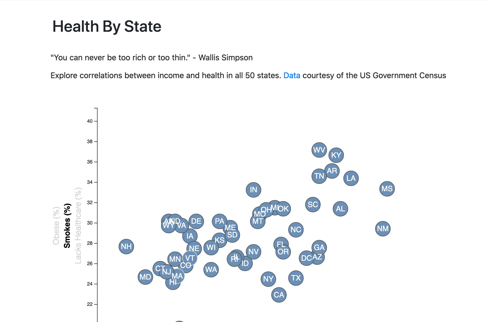
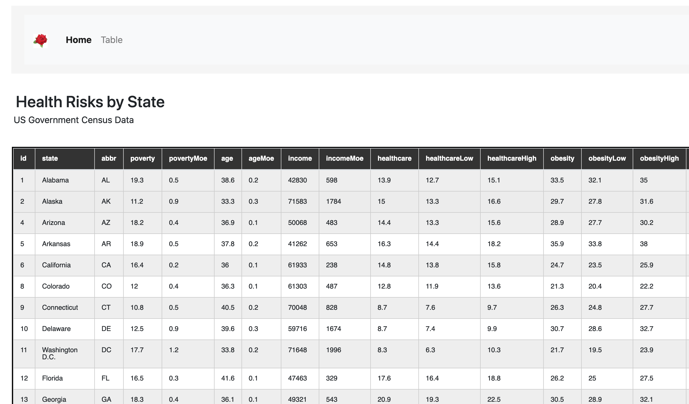

## State of Health

Interactive scatterplot examines rates of obesity, smoking, poverty, age and health across the US.

### Frameworks
D3.js and Bootstrap 4.

### Data
US Government Census 

### Files and Folders
- #### Root Folder
- HTML (index.html) file
##### docs
- contains files and folders for deployment

##### images
- screenshots

### Scatterplot

### Table

