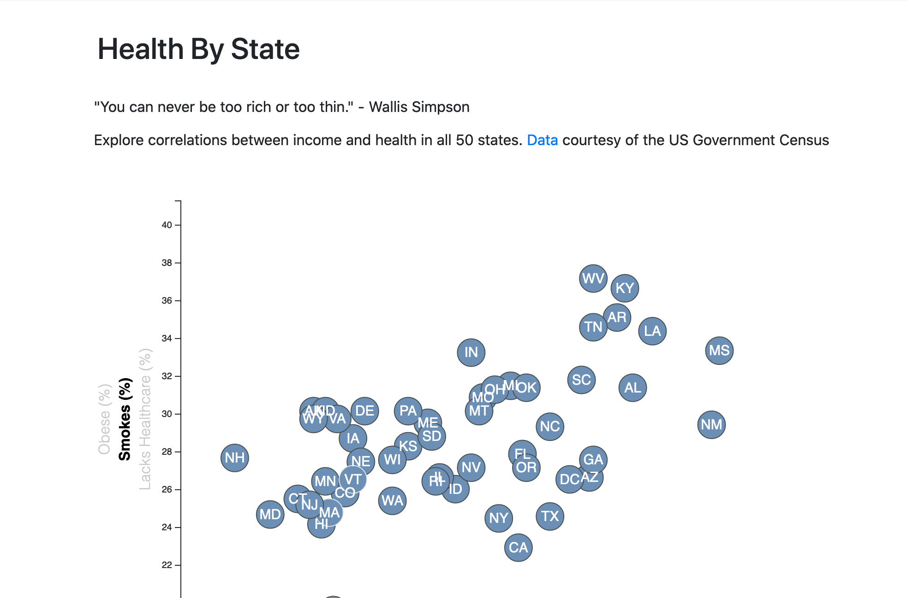
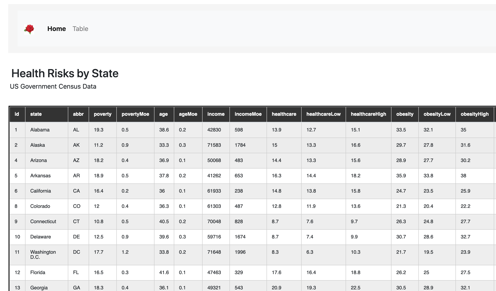

## State of Health

Interactive scatterplot examines rates of obesity, smoking, poverty, age and health across the US.

### Frameworks
D3.js and Bootstrap 4.

### Data
US Government Census 

### Files
Need to run with a server such as node or http.server (python)

### Scatterplot

### Table

